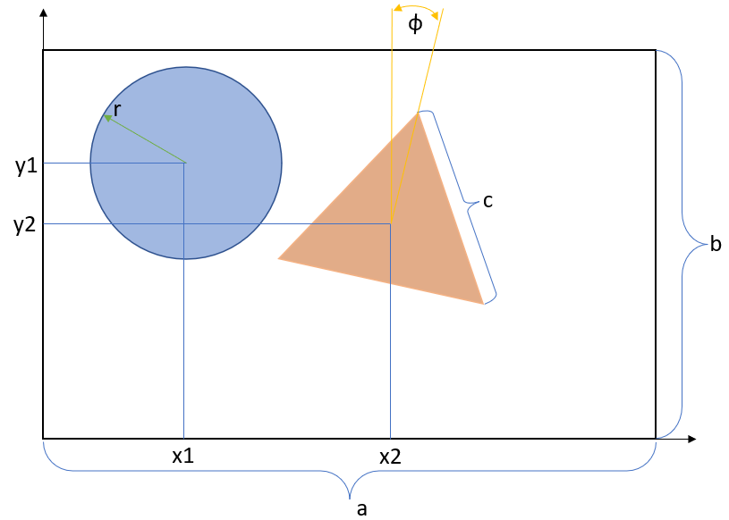

# Area Estimation of a Shape Using OpenMP and the Monte Carlo Method

This project implements a program for estimating the area of a shape formed after cutting a circle and an equilateral triangle from a rectangle. The Monte Carlo method is used for area estimation, with parallel computation enabled by the OpenMP library.

## Problem Description

The task is to estimate the area of a shape formed after cutting the following from a rectangle with side lengths `a` and `b`:
- A circle with radius `r`, centered at point `(x1, y1)`.
- An equilateral triangle with side length `c`, centered at point `(x2, y2)`, rotated by an angle `ф`.

The program estimates the remaining area using the Monte Carlo method by randomly generating points within the rectangle. Different levels of precision for point generation are used to estimate the area:
- 0.1
- 0.001
- 0.000001

The program also compares the accuracy of the area estimation for varying numbers of points:
- 10^3 points
- 10^6 points
- 10^9 points

The program takes into account the possibility of intersections between the shapes (circle and triangle) and the possibility of these shapes extending beyond the rectangle’s boundaries.

## Program Features:
- The program can randomly generate various shapes (circle, triangle, etc.) and their parameters (sizes, locations) to be cut from the rectangle.
- The types of shapes, their parameters, and locations are stored in a file for future use.

## Image examples

## Environment Requirements

- OpenMP library installed for parallel computation.
- C/C++ programming language.

> [UA README version](./README-ua.md)
